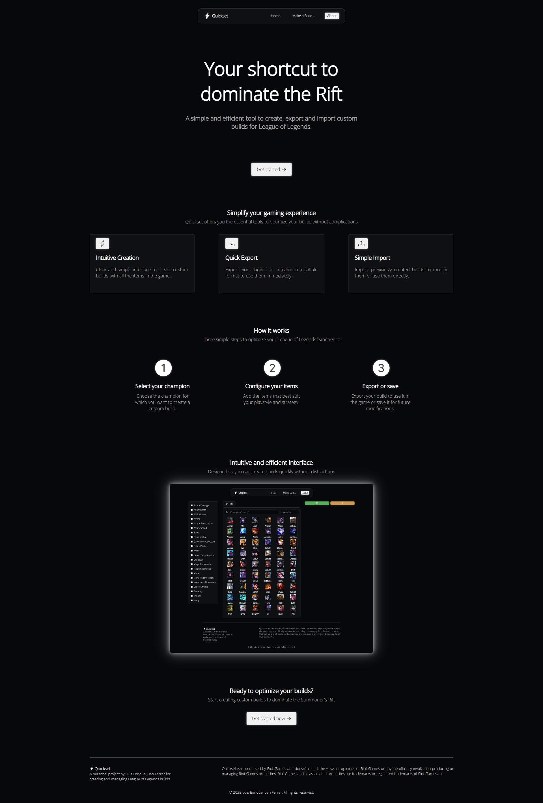
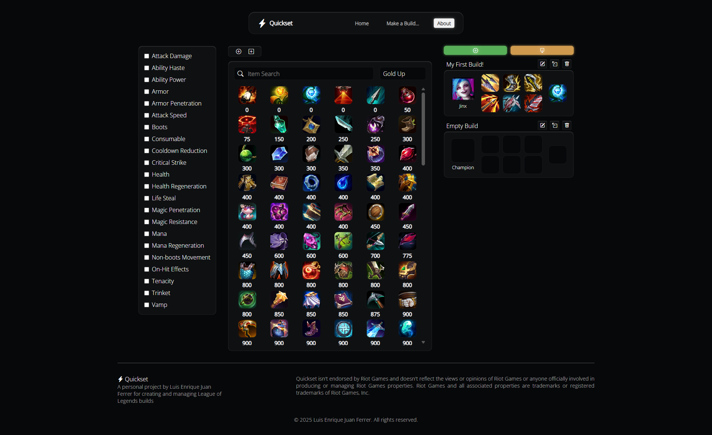
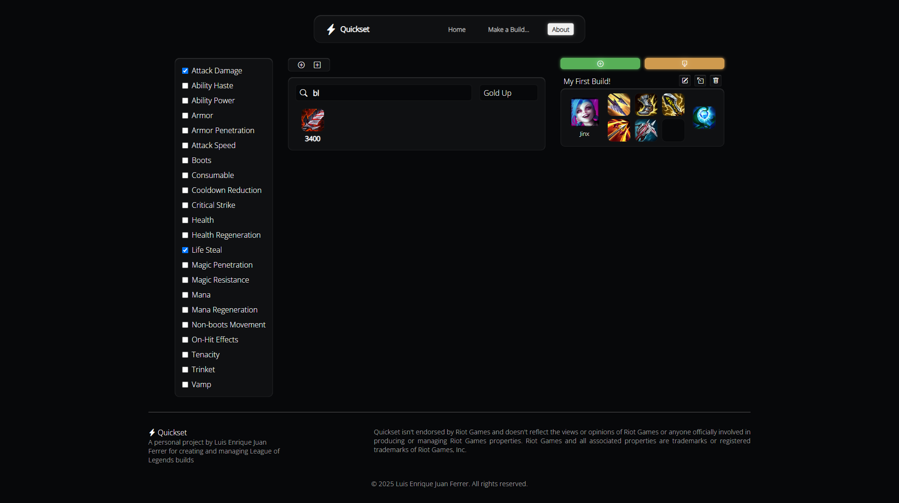
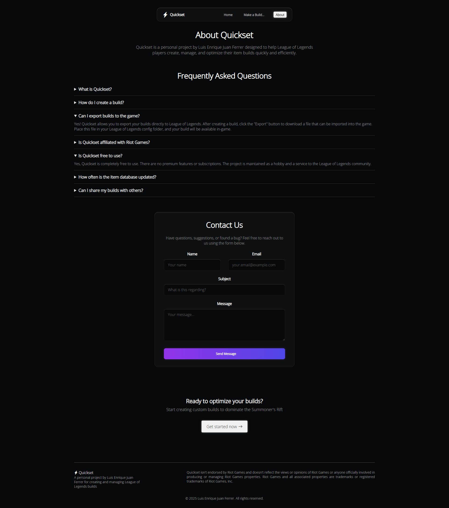

# 🎮 LoLBuilds - Quickset

**Proyecto Intermodular - DAM 1º**  
**Realizado por: Luis Enrique Juan Ferrer**

---

## 📌 Introducción

Este proyecto intermodular nace en el contexto del ciclo formativo de **Desarrollo de Aplicaciones Multiplataforma (DAM)** como una propuesta para demostrar la capacidad de diseñar, implementar y coordinar múltiples componentes de software que interactúan de forma cohesionada.

El objetivo principal es consolidar conocimientos en arquitectura cliente-servidor, consumo de APIs externas, gestión de entornos y despliegue, aplicando buenas prácticas de programación y control de versiones.

---

## 🧠 Resumen Ejecutivo

**LoLBuilds (Quickset)** es una aplicación web que permite a la comunidad de *League of Legends* crear, personalizar y compartir builds de campeones. Utiliza la **API oficial de Riot Games** para obtener datos en tiempo real sobre campeones y objetos.

Está dividido en dos módulos:

- 🧩 **Frontend**: React + TypeScript  
- 🧩 **Backend**: Servidor Spring Boot + Firebase

El sistema está pensado para facilitar la escalabilidad, el mantenimiento y la automatización del flujo de desarrollo.

---

## 📷 Capturas de Pantalla

### 🏠 Página de Inicio


---

### 🛠 Editor de Builds


---

### 🎯 Filtro de Objetos dentro del Editor


### ℹ️ Página "About"


## 🎯 Objetivos del Proyecto

- 🖥 Crear una interfaz visual, intuitiva y dinámica para gestionar builds.
- 🔄 Automatizar la sincronización con la API de Riot Games.
- 🧬 Permitir la exportación e importación de builds en formato JSON.
- 📦 Desarrollar una arquitectura preparada para contenedores (Docker).

---

## 🧱 Estructura del Repositorio

Este repositorio contenedor enlaza dos submódulos:

| Módulo     | Repositorio                                                                 |
|------------|------------------------------------------------------------------------------|
| Frontend   | [lol-builds-ui](https://github.com/luisenriquejuanferrer/lol-builds-ui)                  |
| Backend    | [lol-builds](https://github.com/luisenriquejuanferrer/lol-builds)                        |

```bash
quickset/
├── frontend/    # Interfaz web (React + Vite + TypeScript)
├── backend/     # API REST (Spring Boot + Firebase)
├── assets/      # Assets needed for README.md
└── README.md
